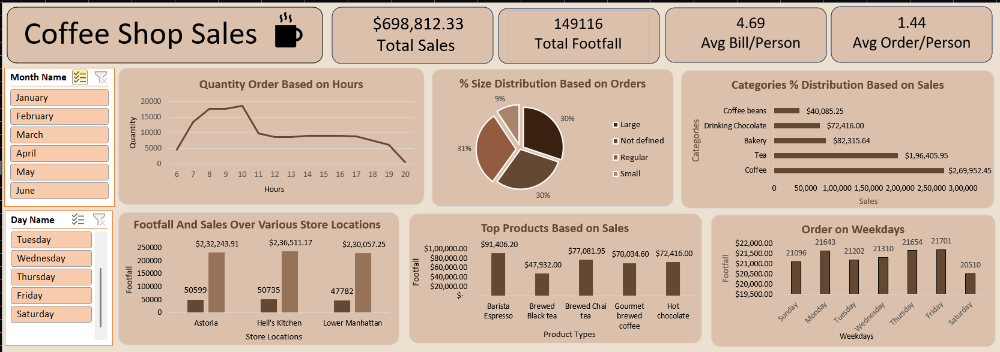

# ☕ Coffee Shop Sales Dashboard

## 📊 Overview
Interactive *Excel dashboard* built to analyze a Coffee Shop chain's 
sales performance, identify peak hours, compare store locations, and 
understand customer ordering patterns across months and weekdays.

---

## 🎯 Problem Statement
The business needed a *single-view dashboard* to monitor sales, 
footfall and product trends across 3 NYC store locations — replacing 
manual tracking with no unified reporting system.

---

## 🛠️ Tech Stack

---

## 🔍 What I Did
- 🟩 Cleaned and structured raw transaction data using Excel
- 🟩 Built Pivot Tables for dynamic KPI calculation
- 🟩 Designed 6-visual interactive dashboard with Month & Day slicers
- 🟩 Analyzed hourly order trends to identify peak business hours
- 🟩 Compared footfall and revenue across 3 store locations

---

## 📈 Key Findings

| Metric | Value |
|--------|-------|
| 💰 Total Sales | $6,98,812.33 |
| 👣 Total Footfall | 1,49,116 |
| 🧾 Avg Bill/Person | $4.69 |
| 📦 Avg Order/Person | 1.44 |
| 🏆 Top Category | Coffee |
| 📍 Highest Footfall Store | Hell's Kitchen (8,629) |
| ⏰ Peak Hours | 9 AM – 11 AM |

---

## 💡 Business Impact
- Morning hours (9–11 AM) drive the highest orders — 
  *staffing and inventory should be prioritized in this window*
- Hell's Kitchen leads in footfall but Astoria leads in revenue — 
  *suggests higher avg order value at Astoria*
- COD-equivalent (walk-in) dominates — 
  *loyalty programs could improve repeat visits*

---
## 📁 Repository Structure
Coffee-Shop-Sales-Dashboard/
├── Data/          → Raw Excel transactions data
├── Dashboard/     → Final Excel .xlsx dashboard file
└── README.md

---
## 🖼️ Dashboard Preview

---

## 📫 Connect with Me

**

---

